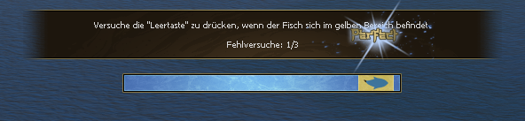

1. Install Python3.12 from Microsoft Store
2. open cmd then install this packages via `pip install pyautogui opencv-python mss keyboard pydirectinput pygetwindow`
3. unpack the zip file in the hdd u installed python, path is up to you.
4. open config.py and edit your target window by editing self.WINDOW_TITLE
5. run start.bat & enjoy
